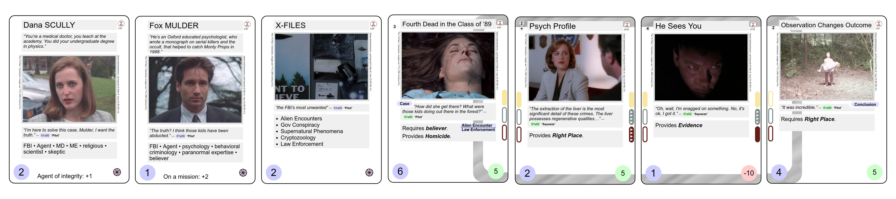
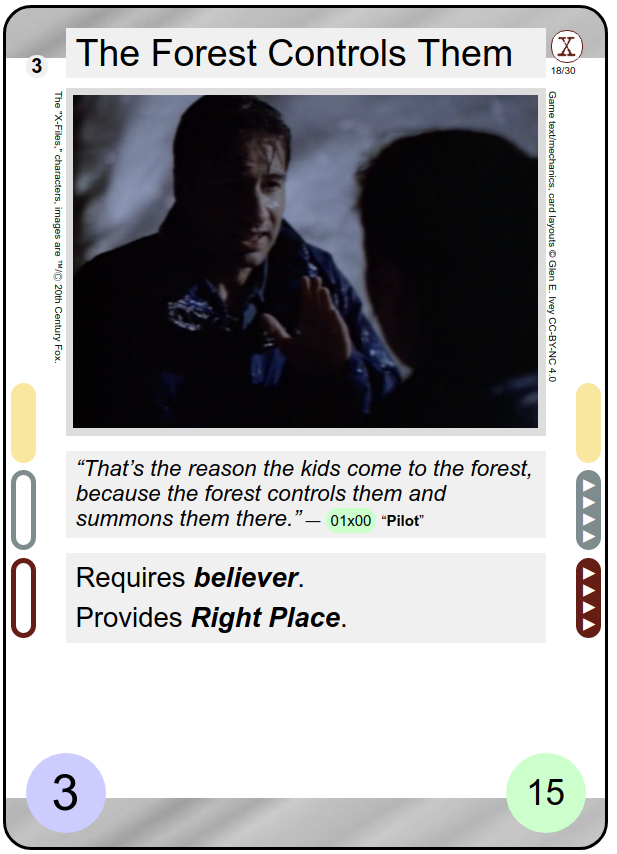
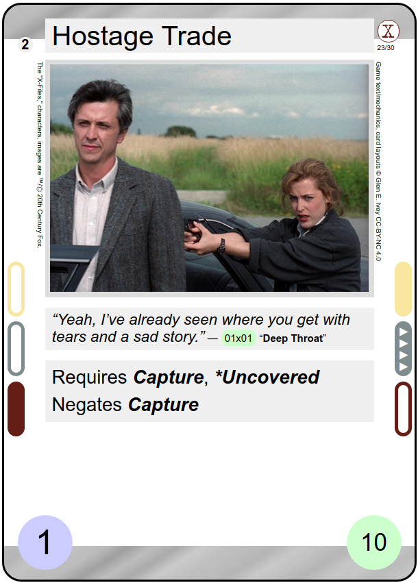

---
---

"The X-Files" Fan CCG
=====================

> **NON-COMMERCIAL**, fan-created, collectible-style card game based
> on _The X-Files_, which is Trademark and [Copyright &copy;
> by](http://www.imdb.com/title/tt0106179/business) Twentieth Century
> Fox Film Corporation.  This game is being produced independently
> from, and in no way endorsed by or affiliated with 20th Century Fox.
> Also, it is completely unrelated to the _[The X-Files Collectible
> Card Game](https://wikipedia.org/wiki/The_X-Files_Collectible_Card_Game)_
> produced in 1996-97 by [US Playing Card
> Company](https://wikipedia.org/wiki/United_States_Playing_Card_Company).

The game is currently very early in development.  Follow its progress
and evolution on Twitter
[@XFilesFanCCG](https://twitter.com/XFilesFanCCG).

Each round, you and your opponent play cards to _jointly_ create a
unique X-Files investigation while simultaneously _competing_ to be
the one who ends the round and scores the round's points.

The _X-Files Fan CCG_ is:
* a card game:  Two players draw and play cards, one wins.

* a deck-building game: There will be a large set of available cards,
and each player assembles their deck independently from them.

*  themed based on
"The X-Files": Card illustrations are from, and names and game
mechanics inspired by, the television show _The X-Files_.

* _not_ endorsed by or associated with "The X-Files": _The X-Files_ is
Trademark and Copyright by the Twentieth Century Fox Film
Corporation, which has not licensed this project.

* _non-commercial_: The game is being designed and created by and for
fans of _The X-Files_, with rules and cards being (solely) distributed
through this website for free.

* designed as a collectible card game: It isn't truly collectible, as
the download-and-print-your-own distribution doesn't limit card
availability or impose rarity.  However, it is designed to meet the
conventions of a collectible card game and could be distributed in
increments of "decks" and (randomized) "booster packs" of cards.

